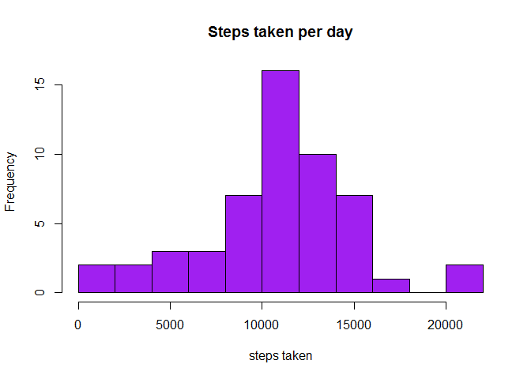
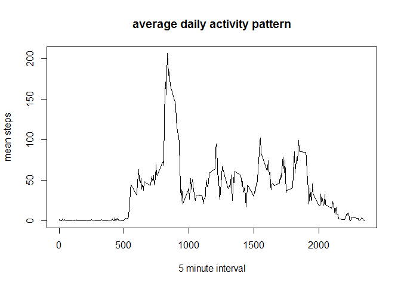
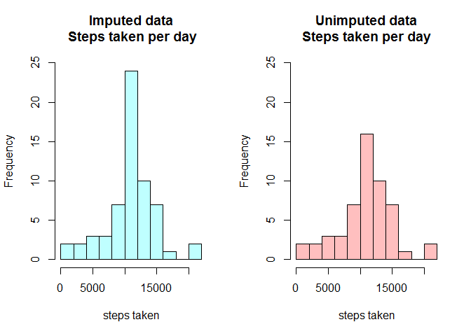
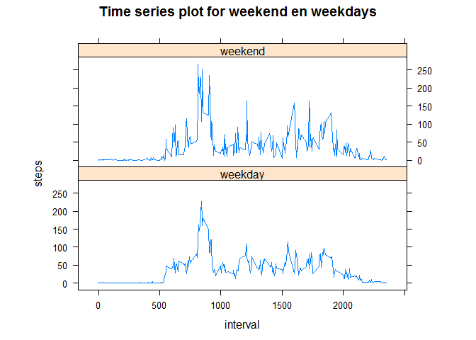

# Reproducible Research: Peer Assessment 1


## Loading and preprocessing the data

First we read in the data from the activity.csv file, that was downloaded from the [course website](https://d396qusza40orc.cloudfront.net/repdata%2Fdata%2Factivity.zip).


```r
setwd("~/R/projecten/Coursera/RepData_PeerAssessment1")
df_act <- read.csv("activity.csv",na.strings = "NA")
```

Next we convert the date column from string to date

```r
df_act$date <- as.Date(as.character(df_act$date))
```

## What is mean total number of steps taken per day?
This part consists of the following steps:

1. Calculate the total number of steps taken per day

```r
df_stepsday <- aggregate(steps ~ date, data=df_act, FUN=sum, na.rm=TRUE )
```
2. Make a histogram of the total number of steps taken each day

```r
hist(df_stepsday$steps,breaks=10,col="purple",xlab="steps taken",main="Steps taken per day")
```

<!-- -->

3. Calculate and report the mean and median of the total number of steps taken per day

```r
cat(paste0("mean of total steps per day: ",mean(df_stepsday$steps)))
```

```
## mean of total steps per day: 10766.1886792453
```

```r
cat(paste0("median of total steps per day: ",median(df_stepsday$steps)))
```

```
## median of total steps per day: 10765
```

## What is the average daily activity pattern?
First we calculate the mean steps per interval across the days and put the results in the vector mean_steps, next we make a time plot with the names and values of this vector. Finally we calculate which interval contains the maximum number of average steps.


```r
mean_steps <- tapply(df_act$steps,INDEX=df_act$interval,FUN=mean,na.rm=TRUE)
plot(names(mean_steps),mean_steps,type="l",xlab="5 minute interval",ylab="mean steps",
     main="average daily activity pattern")
```

<!-- -->

```r
cat(paste("Interval with maximum number of average steps:", names(which.max(mean_steps))))
```

```
## Interval with maximum number of average steps: 835
```


## Imputing missing values
First we calculate and report the total number of missing values in the dataset (i.e. the total number of rows with NAs).

Next we fill in  the missing values in the dataset with the mean for that 5-minute interval

we use this new dataset to make a histogram of the total number of steps taken each day and Calculate and report the mean and median total number of steps taken per day. 


```r
# report number of missing values
cat(paste0("number of missing values: ", sum(is.na(df_act$steps))))
```

```
## number of missing values: 2304
```

```r
# from df_act use either steps, or in case of NA values use the mean of steps at a 
# specific interval and put the result in df_imputed

my_filler <- function(steps,interval) {
  if(is.na(steps)) {
    my_val <- mean_steps[as.character(interval)]
  }
  else {
    my_val <- steps
  }
  
  return(my_val)
}

df_imputed <- df_act
df_imputed$steps <- mapply(FUN=my_filler,df_imputed$steps,df_imputed$interval)
```


Now we create a panelplot with two histogram

```r
df_stepsday_imputed = aggregate(steps ~ date,data=df_imputed,FUN=sum)

par(mfrow=c(1,2))
#first add a histogram for the imputed data
hist(df_stepsday_imputed$steps,breaks=10,col=rgb(0,1,1,1/4),ylim=c(0,25),xlab="steps taken",main="Imputed data\n Steps taken per day")
# add the histogram for the unimputed data to the plot to see if the patterns differ
hist(df_stepsday$steps,breaks=10,col=rgb(1,0,0,1/4),ylim=c(0,25),xlab="steps taken",main="Unimputed data\nSteps taken per day")
```

<!-- -->

```r
cat(paste0("mean steps per day of imputed data: ", mean(df_stepsday_imputed$steps)))
```

```
## mean steps per day of imputed data: 10766.1886792453
```

```r
cat(paste0("median steps per day of imputed data: ", median(df_stepsday_imputed$steps)))
```

```
## median steps per day of imputed data: 10766.1886792453
```

Do these values differ from the estimates from the first part of the assignment? 

The mean and median do not differ much.

What is the impact of imputing missing data on the estimates of the total daily number of steps?
the distribution of the imputed data shows the same shape, with exception of the peak around 10,000.


## Are there differences in activity patterns between weekdays and weekends?
For readability of the source  my (dutch windows) system needs to be set to the english locale.

Next we create a new factor variable in the dataset with two levels - "weekday" and "weekend" indicating whether a given date is a weekday or weekend day.

Next we make a panel plot containing a time series plot (i.e. type = "l") of the 5-minute interval (x-axis) and the average number of steps taken, averaged across all weekday days or weekend days (y-axis). 

```r
# First we set R to english locale (for compatibility with Coursera)
Sys.setlocale("LC_TIME", "English")
```

```
## [1] "English_United States.1252"
```

```r
df_imputed$dayname <- weekdays(df_stepsday_imputed$date)
df_imputed$weekday <- as.factor(
    ifelse(df_imputed$dayname %in% c("Sunday","Saturday"),"weekend","weekday"))

library(lattice)
plotdata <- aggregate(steps ~ interval + weekday, df_imputed, mean)
xyplot(steps ~ interval | factor(weekday), data=plotdata, aspect=1/3, type="l",
       main = "Time series plot for weekend en weekdays")
```

<!-- -->

